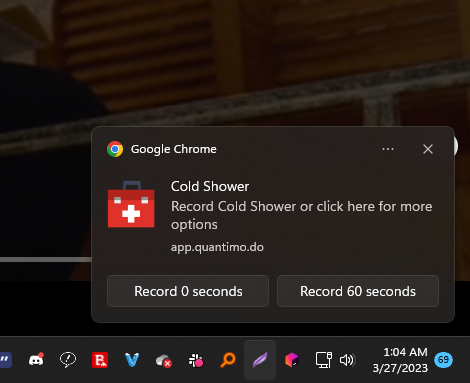
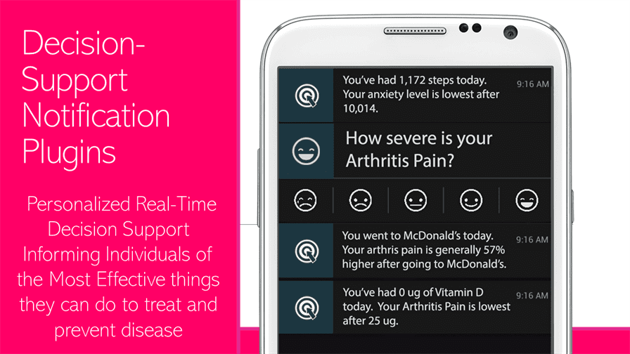

# 🌎The Decentralized FDA💊

This [monorepo](docs/contributing/repo-structure.md) contains a set of [FAIR](docs/contributing/fair.md) [libraries](libs) and [apps](apps) to help people and organizations quantify the positive and negative effects of every food, supplement, drug, and treatment on every measurable aspect of human health and happiness.

# 😕 Why are we doing this?

The current system of clinical research, diagnosis, and treatment is  failing the billions of people are suffering from chronic diseases.

[👉 Problems we're trying to fix...](docs/stuff-that-sucks.md)

# 🧪 Our Hypothesis

By harnessing global collective intelligence and oceans of real-world data we hope to emulate Wikipedia's speed of knowledge generation. 

  
👉 How to generate discoveries 50X faster and 1000X cheaper than current systems...

## Global Scale Clinical Research + Collective Intelligence = 🤯

So in the 90's, Microsoft spent billions hiring thousands of PhDs to create Encarta, the greatest encyclopedia in history.  A decade later, when Wikipedia was created, the general consensus was that it was going to be a dumpster fire of lies.  Surprisingly, Wikipedia ended up generating information 50X faster than Encarta and was about 1000X cheaper without any loss in accuracy.  This is the magical power of crowdsourcing and open collaboration.

Our crazy theory is that we can accomplish the same great feat in the realm of clinical research.  By crowdsourcing real-world data and observations from patients, clinicians, and researchers, we hope the Decentralized FDA could also generate clinical discoveries 50X faster and 1000X cheaper than current systems.

## The Potential of Real-World Evidence-Based Studies

- **Diagnostics** - Data mining and analysis to identify causes of illness
- **Preventative medicine** - Predictive analytics and data analysis of genetic, lifestyle, and social circumstances
  to prevent disease
- **Precision medicine** - Leveraging aggregate data to drive hyper-personalized care
- **Medical research** - Data-driven medical and pharmacological research to cure disease and discover new treatments and medicines
- **Reduction of adverse medication events** - Harnessing of big data to spot medication errors and flag potential
  adverse reactions
- **Cost reduction** - Identification of value that drives better patient outcomes for long-term savings
- **Population health** - Monitor big data to identify disease trends and health strategies based on demographics,
  geography, and socioeconomic

# 🖥️ dFDA Framework Components

This is a very high-level overview of the architecture. 

The core characteristics that define the dFDA are:
- **Modularity** - a set of modular libraries and tools that can be reused in any project
- **Protocols** - an abstract framework of core primitive components rather than a specific implementation
- **Interoperability** - a directory of existing open-source projects that can be used to fulfill the requirements of each primitive or component
- **Collective Intelligence** - a collaborative effort, so please feel free to [contribute or edit anything](docs/contributing.md)!

## 1. Data Silo API Gateway Nodes

[dFDA Gateway API Nodes](docs/components/data-silo-gateway-api-nodes) should make it easy for data silos, such as hospitals and digital health apps, to let people export and save their data locally in their [PersonalFDA Nodes](#2-personalfda-nodes).

**👉 [Learn More About Gateway APIs](docs/components/data-silo-gateway-api-nodes/data-silo-api-gateways.md)**

## 2. PersonalFDA Nodes

[PersonalFDA Nodes](docs/components/personal-fda-nodes/personal-fda-nodes.md) are applications that can run on your phone or computer. They import, store, and analyze your data to identify how various factors affect your health.  They can also be used to share anonymous analytical results with the [Clinipedia dFDA Wiki](#3-clinipediathe-wikipedia-of-clinical-research) in a secure and privacy-preserving manner.

[PersonalFDA Nodes](docs/components/personal-fda-nodes/personal-fda-nodes.md) are composed of two components, a [Digital Twin Safe](docs/components/digital-twin-safe/digital-twin-safe.md) and a [personal AI agent](docs/components/optimiton-ai-agent/optomitron-ai-agent.md) applies causal inference algorithms to estimate how various factors affect your health.

### 2.1. Digital Twin Safes

aider

A local application for self-sovereign import and storage of personal data.

**👉[Learn More or Contribute to Digital Twin Safe](docs/components/digital-twin-safe/digital-twin-safe.md)**

### 2.2. Personal AI Agents

[Personal AI agents](docs/components/optimiton-ai-agent/optomitron-ai-agent.md) that live in your [PersonalFDA nodes](docs/components/personal-fda-nodes/personal-fda-nodes.md) and use [causal inference](docs/components/optimiton-ai-agent/optomitron-ai-agent.md) to estimate how various factors affect your health.

**👉[Learn More About Optimitron](docs/components/optimiton-ai-agent/optomitron-ai-agent.md)**

## 3. Clinipedia—The Wikipedia of Clinical Research

The [Clinipedia wiki](docs/components/clinipedia/clinipedia.md) should be a global knowledge repository containing the aggregate of all available data on the effects of every food, drug, supplement, and medical intervention on human health.

**[👉 Learn More or Contribute to the Clinipedia](docs/components/clinipedia/clinipedia.md)**

### 3.1 Outcome Labels

A key component of Clinipedia are [**Outcome Labels**](docs/components/outcome-labels/outcome-labels.md) that list the degree to which the product is likely to improve or worsen specific health outcomes or symptoms.

**👉 [Learn More About Outcome Labels](docs/components/outcome-labels/outcome-labels.md)**

## Human-AI Collective Intelligence Platform

A collective intelligence coordination platform is needed for facilitating cooperation, communication, and collaborative actions among contributors.

**[👉 Learn More or Contribute to the dFDA Collaboration Framework](docs/components/human-ai-collective-intelligence-platform/dfda-collaboration-framework.md)**

# Roadmap

We'd love your help and input in determining an optimal roadmap for this project.

**[👉 Click Here for a Detailed Roadmap](docs/roadmap.md)**

# Why a Monorepo?

Our goal is to develop [FAIR (Findable, Accessible, Interoperable, and Reusable)](docs/contributing/fair.md) data and analytical tools that can be used by any regulatory agencies, businesses, non-profits or individuals to quantify the effects of every food, drug, supplement, and treatment on every measurable aspect of human health and happiness.

The [Nx Monorepo](docs/contributing/repo-structure.md) is to achieve maximum interoperability and minimum duplication of effort between the various 
projects in order to maximize the speed of development and minimize costs.  This can be 
done by modularizing the codebase into libraries and plugins that can be shared between the various projects.

Apps in this monorepo:

- [dFDA-1](apps/dfda-1) - The first version of the decentralized FDA. It is a web app that allows users to track their health data and analyze it to identify the most effective ways to maximize health and happiness.
- Yours? - If you'd like to create the next version of the dFDA, expand its functionality, or get help with your app, feel free to add it to the [apps](apps) folder and submit a pull request.

# dFDA v1 Prototype

We've got a monolithic centralized implementation of the dFDA at [apps/dfda-1](apps/dfda-1) that we're wanting to modularize and decentralize into a set of [FAIR](docs/contributing/fair.md) [libraries](libs) and plugins that can be shared with other apps.

Currently, the main apps are the [Demo Data Collection, Import, and Analysis App](https://app.crowdsourcingcures.org) and the
[Journal of Citizen Science](https://studies.crowdsourcingcures.org).

### Features

* [Data Collection](docs/components/data-collection/data-collection.md)
* [Data Import](docs/components/data-import/data-import.md)
* [Data Analysis](#data-analysis)
  * [🏷️Outcome Labels](#-outcome-labels)
  * [🔮Predictor Search Engine](docs/components/predictor-search-engine/predictor-search-engine.md)
  * [🥕 Root Cause Analysis Reports](docs/components/root-cause-analysis-reports/root-cause-analysis-reports.md)
  * [📜Observational Mega-Studies](docs/components/observational-studies/observational-studies.md)
* [Real-Time Decision Support Notifications](https://www.curedao.org/blog/optomitron)
* [No Code Health App Builder](https://www.curedao.org/blog/no-code-health-app-builder)
* [Personal AI Agent](docs/components/optimiton-ai-agent/optomitron-ai-agent.md)
* [Chrome Extension](https://www.curedao.org/blog/chrome-extension)

&nbsp

  

Collects and aggregate data on symptoms, diet, sleep, exercise, weather, medication, and anything else from dozens
of life-tracking apps and devices. Analyzes data to reveal hidden factors exacerbating or improving symptoms of
chronic illness.

### Web Notifications

Web and mobile push notifications with action buttons.

### Browser Extensions

By using the Browser Extension, you can track your mood, symptoms, or any outcome you want to optimize in a fraction of a second using a unique popup interface.

### Data Analysis

The Analytics Engine performs temporal precedence accounting, longitudinal data aggregation, erroneous data filtering, unit conversions, ingredient tagging, and variable grouping to quantify correlations between symptoms, treatments, and other factors.

It then pairs every combination of variables and identifies likely causal relationships using correlation mining algorithms in conjunction with a pharmacokinetic model.  The algorithms first identify the onset delay and duration of action for each hypothetical factor. It then identifies the optimal daily values for each factor.

[👉 More info about data analysis](docs/components/data-analysis/data-analysis.md)

### 🏷 Outcome Labels

[More info about outcome labels](docs/components/outcome-labels/outcome-labels.md)

### Real-time Decision Support Notifications

[More info about real time decision support](docs/components/outcome-labels/outcome-labels.md)

### 📈 Predictor Search Engine

[👉 More info about the predictor search engine...](docs/components/predictor-search-engine/predictor-search-engine.md)

### Auto-Generated Observational Studies

[👉 More info about observational studies...](docs/components/observational-studies/observational-studies.md)

# 🤚 Tell Us About Your Project!

🤝 **Join Us**: Whether you're a developer, researcher, health professional, regulatory, or simply passionate about health innovation, your contribution can make a monumental difference!

[👉 Tell Us About Your Project!](docs/community_directory/README.md)

# 🤚 Help Wanted!

Code or documentation improvements are eternally appreciated!

It's our goal to avoid any duplication of effort. So please include existing projects that would be interested in fulfilling any part of this global framework.

**[👉 Click Here to Contribute](docs/contributing.md)**

# 🛟 Support

If you have any questions or need help, please [create an issue](https://github.com/decentralized-fda/decentralized-fda/issues/new) instead of emailing us so that others can benefit from the discussion.
