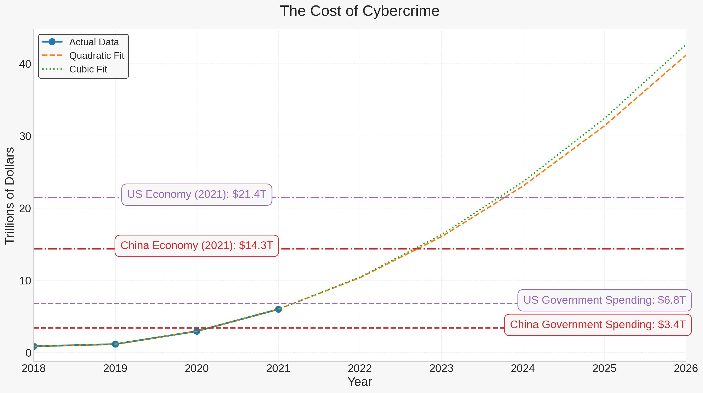
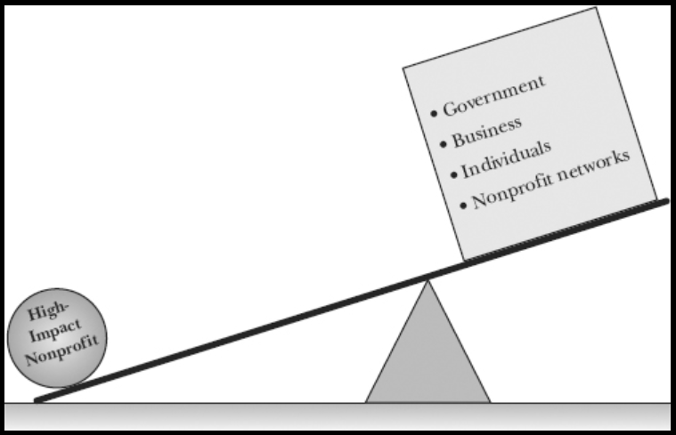
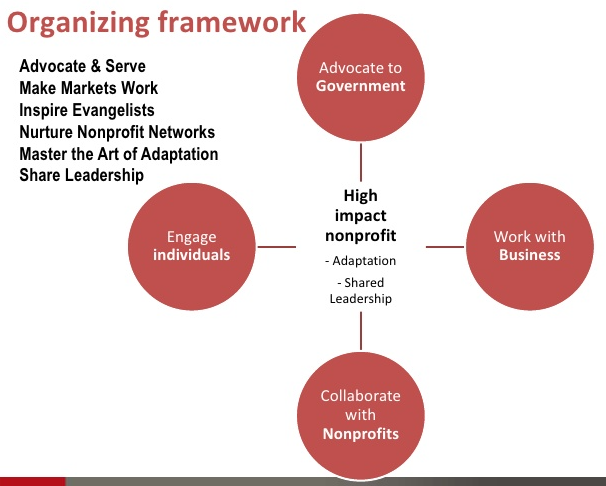
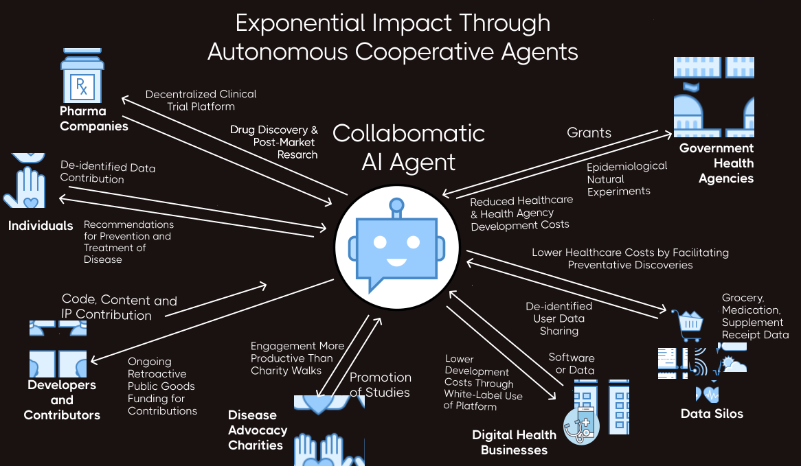

# Positron: Agents for Good

_An Autonomous Agent Framework to Maximize Public Goods_

## Overview

Non-profits are constrained by limited cognitive bandwidth and resources to achieve their mission. The highest leverage thing we can do at this point is to make it as easy as possible for these organizations to operationalize autonomous agents.  Positron is an autonomous agent framework designed to discover and play positive sum games for a net positive sum future.

## Current Limitations

Current state-of-the-art AI models do not have the reasoning capabilities and context length required to autonomously advance the missions of nonprofits. However, these capabilities are rapidly evolving, and we can expect to see significant advancements in the next few years.

It would be very valuable for pro-social entities to have a framework that enables them to easily operationalize autonomous agents as soon as the technology is ready. 

## Isn't This Dangerous?

Regardless of what we do, cybercriminals and authoritarian governments will continue to use AI for antisocial purposes.  The only thing we can do is attempt to shift the balance of power in favor of pro-social entities.

Anti-social entities like cybercriminal organizations are already using AI to automate their operations and maximize their impact. Even without autonomous agents, parasitic cybercriminals are extracting more and more value from the productive economy which makes pro-social non-profits possible.  The cost of cybercrime is projected to reach [$10.5 trillion annually by 2025](https://www.forbes.com/sites/forbestechcouncil/2023/02/22/105-trillion-reasons-why-we-need-a-united-response-to-cyber-risk/?sh=aa441d13b0c4), which is more than the GDP of any country except the US and China.

If the exponential trend continues, the parasite could kill its host by extracting more value than the host can produce. Governments currently apprehend a tiny percentage of cybercriminals, so it's unlikely that they will be able to stop this trend. 

Governments are [spending billions](https://www.marketsandmarkets.com/Market-Reports/artificial-intelligence-military-market-41793495.html) on "slaughter bots" and other autonomous weapons as well as [mass surveillance](https://www.wired.com/story/ai-surveillance-cameras-europe/).  

### Primary Objective Functions: Tilting the Balance of Power to a Positive Future

More than changing human trajectories, super-intelligence is likely to amplify existing trends by optimizing for the primary objective functions of existing entities.
Although people have myriad motivations, there is generally a primary objective function that is most characteristic of each group.

1. **Criminals** - Drain maximum resources from the cooperative productive economy.  AI is perfectly suited for cybercrime and will allow cybercriminals to effectively clone themselves a million times over. 
2. **Politicians** - Maximize power.  Obviously, there are wonderful people with wonderful intentions in government.  However, decency can be a major disadvantage in politics.  The dark triad traits, which include Machiavellianism, psychopathy, and narcissism, have been found to be [far more predictive](https://www.frontiersin.org/articles/10.3389/fpos.2021.657750/full) of political power attainment.
3. **Corporations** - Maximize profits. This can be good in the sense that it incentivizes the creation of products and services that people want.  However, the most profitable thing a company can do is get government subsidies. ROI of corporate lobbying can be as high as [22,000%](https://www.freshonomics.org/blog/2021/3/14/the-logic-of-lobbying-how-do-you-turn-58-billion-into-44-trillion) compared to free market profit margins around [10%](https://www.capterra.com/resources/what-is-good-profit-margin-for-small-business/). 
4. **Nonprofits** - **Maximize global health and happiness** (in a very general sense on average). 

So only one of these entities has a primary objective function that is aligned with the interests of humanity as a whole.  Unfortunately, the non-profit sector isn't generally known for its efficiency.

### AI Arms Race Conditions

There's not much we can do to reduce autonomous AI adoption by cybercriminals and authoritarian governments and the inevitable harm that results. So despite the risks associated with autonomous agents, it's critical that we weight humanity's trajectory in favor of the most positive objective functions.

## Maximizing Leverage for Good

In a word, what separates effective non-profits from ineffective ones is leverage.

The highest leverage thing anyone can do at this point is to make it as easy as possible for pro-social entities to accelerate their mission through autonomous agents.

# Framework Design

To design an autonomous agent framework for nonprofits, we can leverage the principles outlined in the book [_Forces for Good_](https://www.google.com/books/edition/Forces_for_Good/OvlH81q2cBQC?hl=en&gbpv=1&printsec=frontcover) by Leslie Crutchfield and Heather McLeod Grant. 

The framework should enable nonprofits to effectively work with government, tap into the power of free markets, nurture nonprofit networks, build movements of evangelists, share leadership internally, and adapt quickly to changing conditions.

[Source: Forces for Good
The Six Practices of High-Impact Nonprofits](https://www.google.com/books/edition/Forces_for_Good/OvlH81q2cBQC?hl=en&gbpv=1&printsec=frontcover)

## Types of Agents

[ChatDev](https://github.com/OpenBMB/ChatDev)

The autonomous agent framework should facilitate the following functionalities:

1. **Advocacy and Research Agent**: Autonomous agents can be programmed to monitor and analyze government policies and market trends relevant to the nonprofit's mission. They can provide summaries and insights to guide the nonprofit's advocacy efforts.

2. **Market Engagement Agent**: Agents can identify potential business partnerships, sustainable business practices, and opportunities for earned income. They can facilitate interactions with businesses to promote mutually beneficial collaborations.

3. **Community Engagement Agent**: Autonomous agents can help in nurturing nonprofit networks by identifying potential partners, events, and collaborative opportunities within the local community.

4. **Movement Building Agent**: Agents can be designed to engage and mobilize volunteers and supporters, disseminate information, and facilitate community involvement to build movements of evangelists for the nonprofit's cause.

5. **Adaptation and Leadership Agent**: The framework should support adaptive decision-making and leadership sharing within the nonprofit, enabling quick responses to changing conditions and effective internal collaboration.

## Framework Requirements

- user-friendly and customizable for non-technical users
- scalable to accommodate the diverse needs and capacities of nonprofits, including smaller, locally focused organizations with modest budgets
- open-source and interoperable with other frameworks and tools
- provide cost projections and reports to help nonprofits plan and budget for the framework's implementation

## Possible Foundational Frameworks

There are several open-source frameworks that could serve as the foundation for the autonomous agent framework for nonprofits. 

[👉 Here are a few examples](positron/custom-gpts/positron-designer-gpt/knowledge/autonomous-agent-frameworks.md)

# Example Implementations

## Longevity Focused Non-Profit

 To describe the implementation of Positron in a longevity-focused non-profit, we can outline the activities of autonomous agents and the outcome impact measurements that they would seek to maximize:

**Activities of Autonomous Agents:**

1. **Research and Data Analysis Agent**:
  - **Activity**: Continuous monitoring of scientific literature and research on aging, longevity, and related fields.
  - **Outcome Impact Measurement**: Number of relevant research papers analyzed, with a focus on identifying breakthroughs and potential interventions for extending human lifespan.

2. **Clinical Trial Matching Agent**:
  - **Activity**: Analyzing clinical trial databases and medical records to identify suitable clinical trials for individuals interested in participating.
  - **Outcome Impact Measurement**: Number of individuals successfully matched with clinical trials, potentially leading to new treatments or therapies.

3. **Fundraising and Grant Application Agent**:
  - **Activity**: Identifying potential donors, grant opportunities, and fundraising campaigns.
  - **Outcome Impact Measurement**: Amount of funds raised and grants secured to support aging research and related projects.

4. **Advocacy and Policy Agent**:
  - **Activity**: Monitoring aging-related policies, engaging with policymakers, and advocating for policies that support longevity research.
  - **Outcome Impact Measurement**: Number of policy changes influenced in favor of longevity research and advocacy initiatives.

5. **Community Engagement Agent**:
  - **Activity**: Building and nurturing a community of individuals interested in longevity, hosting webinars, and organizing local events.
  - **Outcome Impact Measurement**: Number of community members actively engaged in discussions, events, and educational programs related to lifespan extension.

6. **Educational Content Agent**:
  - **Activity**: Developing and disseminating educational content, including articles, videos, and webinars, to raise awareness about aging and longevity science.
  - **Outcome Impact Measurement**: Number of people educated about the science of aging and its implications for healthy lifespan extension.

7. **Longevity Clinic Partnership Agent**:
  - **Activity**: Identifying partnerships with longevity-focused clinics and healthcare providers.
  - **Outcome Impact Measurement**: Number of partnerships established, leading to increased access to longevity-focused healthcare services.

**Outcome Impact Measurements to Maximize:**

1. **Extension of Healthy Lifespan**:
  - **Metric**: Increase in the average healthy lifespan of individuals within the community.
  - **How**: By supporting and promoting research and interventions that have the potential to extend healthspan and lifespan.

2. **Funding for Longevity Research**:
  - **Metric**: Total funds raised and secured for longevity research projects.
  - **How**: By successfully identifying donors, securing grants, and organizing effective fundraising campaigns.

3. **Clinical Trial Participation**:
  - **Metric**: Number of individuals from the community participating in longevity-related clinical trials.
  - **How**: By matching interested individuals with suitable trials and providing information and support throughout the process.

4. **Policy Influence**:
  - **Metric**: Number of policy changes influenced in favor of longevity research and advocacy.
  - **How**: By engaging with policymakers, advocating for supportive policies, and mobilizing the community for advocacy efforts.

5. **Community Engagement**:
  - **Metric**: Growth in community and active participation in discussions and events.
  - **How**: By fostering a vibrant and engaged community through educational content, webinars, and local events.

6. **Public Awareness**:
  - **Metric**: Increased media coverage and social media mentions related to longevity and aging science.
  - **How**: By producing and sharing educational content and participating in public discussions on aging and longevity.

The implementation of Positron would involve a network of autonomous agents working together to achieve these outcome impact measurements. These agents would leverage data analysis, advocacy, community engagement, and educational efforts to advance the organization's mission of extending healthy human lifespan.

## FDAi-Specific Autonomous Agent Framework

Applying these principles specifically to the FDAi framework would entail the following elements and functions:

1. **Serve Individuals and Advocate on Their Behalf:**
- **Data Collection and Analysis Module:** This module helps individuals collect and analyze personal data to uncover factors affecting their health, especially in areas like dementia or mental illness. It uses AI to identify patterns and risk factors from the collected data.
- **Policy Advocacy Interface:** Interfaces with government portals to submit policy change requests and resource allocation proposals based on the data analysis.

2. **Make Markets Work:**
- **Market Integration Module:** Develops partnerships with businesses (like pharmacies, online grocers, healthcare providers) for data exchange and service provision. It should have capabilities to analyze market trends and suggest potential partnerships or business models, like software development or data analysis services.
- **Business Collaboration Toolkit:** Facilitates collaboration with businesses, aligning nonprofit goals with corporate social responsibility initiatives.

1. **Inspire Evangelists:**
- **Community Engagement Engine:** This part of the framework manages volunteer databases, rewarding citizen scientists and researchers. It uses gamification strategies to engage users, tracking and rewarding contributions.
- **Evangelist Development Program:** Develops training modules and engagement strategies to convert supporters into active evangelists.

4. **Building Non-Profit Networks:**
- **Open Source Software Development Kit:** Provides tools and templates for other nonprofits to use in data collection and analysis.
- **Affiliate Network Coordinator:** Manages and supports local affiliate groups, fostering collaboration among patients, physicians, researchers, data scientists, and programmers.

5. **Master the Art of Adaptation:**
- **Adaptive Learning System:** Continuously analyzes the effectiveness of various strategies and adapts them based on feedback and changing circumstances. It learns from successes and failures to refine approaches.
- **Innovation Lab:** A virtual space for testing new ideas and methodologies, allowing for controlled experimentation.

6. **Share Leadership:**
- **Distributed Leadership Platform:** Distributes decision-making powers across the organization and network. Includes tools for collaboration, consensus-building, and conflict resolution.
- **Leadership Development Module:** Focuses on building leadership skills throughout the organization, including training programs for upcoming leaders and boards.

# Related Docs

- [Tentative Roadmap](roadmap.md)
- [Staff](staff.md)

# References

* [The Complete Beginner's Guide to Autonomous Agents](https://www.mattprd.com/p/the-complete-beginners-guide-to-autonomous-agents)
* [Local Forces for Good](https://ssir.org/articles/entry/local_forces_for_good)
* [Review of Crutchfield](https://scott.london/reviews/crutchfield.html)
* [Multi-Agent Conversational Framework](https://www.frontiersin.org/articles/10.3389/frobt.2021.719496)
* [OpenBMB ChatDev](https://github.com/OpenBMB/ChatDev)
* [Botpress Blog: Open Source Chatbots](https://botpress.com/blog/open-source-chatbots)
* [Microsoft Autogen Use Cases](https://microsoft.github.io/autogen/docs/Use-Cases/agent_chat/)
* [Aiwaves Agents](https://github.com/aiwaves-cn/agents)
* [SuperAGI Official Website](https://superagi.com)
* [Hindustan Times Article: AI Chatbot Creates Software in Just Seven Minutes](https://www.hindustantimes.com/technology/ai-chatbot-creates-software-in-just-seven-minutes-with-a-cost-of-less-than-1-study-101694534558798.html)
* [Microsoft Research Paper: Autogen - Enabling Next-Gen LLM Applications via Multi-Agent Conversation Framework](https://www.microsoft.com/en-us/research/publication/autogen-enabling-next-gen-llm-applications-via-multi-agent-conversation-framework/)
* [arXiv Paper: Multi-Agent Conversation Framework](https://arxiv.org/abs/2309.07870)
* [SuperAGI Community](https://superagi.com/community/)
* [MLQ Open Source AI Agents](https://www.mlq.ai/open-source-ai-agents/)
* [Microsoft Autogen Project](https://www.microsoft.com/en-us/research/project/autogen/)
* [Hugging Face Paper](https://huggingface.co/papers/2309.07870)
* [TransformerOptimus SuperAGI GitHub](https://github.com/TransformerOptimus/SuperAGI)
* [Instant Art Article: Revolutionizing Software Development with AI-Driven Agents](https://instantart.io/chatdev-revolutionizing-software-development-with-ai-driven-agents/)
* [Reddit Discussion: My Take on Microsoft's Autogen for Multi-Agent Chat](https://www.reddit.com/r/LocalLLaMA/comments/16yzo57/my_take_on_microsofts_autogen_for_multiagent_chat/)
* [arXiv Paper PDF: Multi-Agent Conversation Framework](https://arxiv.org/pdf/2309.07870.pdf%EF%BC%8C.pdf)
* [LinkedIn Article: Getting Started with SuperAGI Infrastructure for Building Useful Agents](https://www.linkedin.com/pulse/getting-started-superagi-infrastructure-building-useful-sikdar)
* [LinkedIn Article: Open Source Contribution to AI](https://www.linkedin.com/posts/munsifraza_opensource-contribution-ai-activity-7109585315329114112-qA36)
* [Microsoft Autogen GitHub](https://github.com/microsoft/autogen)
* [Reddit Discussion: Agents - An Open-Source Framework for Autonomous Agents](https://www.reddit.com/r/LocalLLaMA/comments/16jl53m/agents_an_opensource_framework_for_autonomous/)
* [Awesome-SuperAGI GitHub](https://github.com/TransformerOptimus/Awesome-SuperAGI)
* [Verloop Blog: The Best Open-Source Chatbot Platforms](https://verloop.io/blog/the-best-open-source-chatbot-platforms/)
* [YouTube Video: SuperAGI Introduction](https://youtube.com/watch?v=JFotv9PVW_4)
* [YouTube Video: SuperAGI Demo](https://youtube.com/watch?v=1a3ky1Kx1xs)
* [SourceForge SuperAGI](https://sourceforge.net/software/product/SuperAGI/)
* [Airdroid AI Insights: Open-Source Chatbot](https://www.airdroid.com/ai-insights/open-source-chatbot/)
