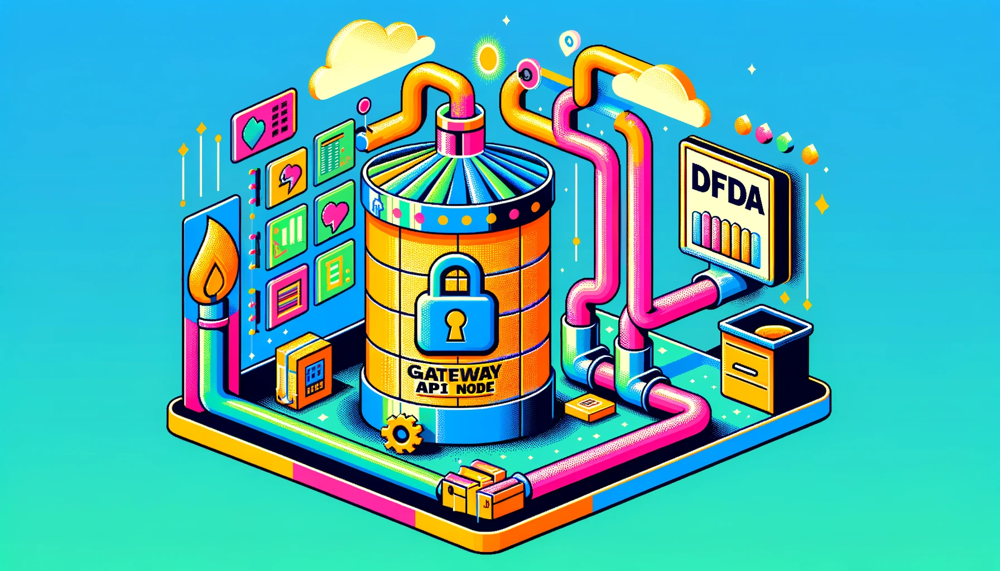

# 💊 The Decentralized FDA 🌎

A global federation to help the FDA and global regulatory agencies quantify the effects of millions of factors like foods, drugs, and supplements affect human health.

🤝 **Join Us**: Whether you're a developer, researcher, health professional, regulatory, or simply passionate about health innovation, your contribution can make a monumental difference!

[👉 Tell Us About Your Project!](#)

# 🛟 Help Wanted!

Code or documentation improvements are eternally appreciated! 

It's our goal to avoid any duplication of effort. So please include existing projects that would be interested in fulfilling any part of this global framework.

**[👉 Click Here to Contribute](contributing.md)**

# 😕 Why are we doing this?

The current system of clinical research, diagnosis, and treatment is miserably failing the billions of people are suffering from chronic diseases.

👉 [Click to learn more about why it sucks...](stuff-that-sucks.md)

# 🧪 Our Hypothesis

By harnessing global collective intelligence and oceans of real-world data we hope to generate discoveries 50X faster and 1000X cheaper than current systems.

  
👉 Click to learn more about what's possible...

## Global Scale Clinical Research + Collective Intelligence = 🤯

So in the 90's, Microsoft spent billions hiring thousands of PhDs to create Encarta, the greatest encyclopedia in history.  A decade later, when Wikipedia was created, the general consensus was that it was going to be a dumpster fire of lies.  Surprisingly, Wikipedia ended up generating information 50X faster than Encarta and was about 1000X cheaper without any loss in accuracy.  This is the magical power of crowdsourcing and open collaboration.

Our crazy theory is that we can accomplish the same great feat in the realm of clinical research.  By crowdsourcing real-world data and observations from patients, clinicians, and researchers, we hope the Decentralized FDA could also generate clinical discoveries 50X faster and 1000X cheaper than current systems.

## The Potential of Real-World Evidence-Based Studies

- **Diagnostics** - Data mining and analysis to identify causes of illness
- **Preventative medicine** - Predictive analytics and data analysis of genetic, lifestyle, and social circumstances
  to prevent disease
- **Precision medicine** - Leveraging aggregate data to drive hyper-personalized care
- **Medical research** - Data-driven medical and pharmacological research to cure disease and discover new treatments and medicines
- **Reduction of adverse medication events** - Harnessing of big data to spot medication errors and flag potential
  adverse reactions
- **Cost reduction** - Identification of value that drives better patient outcomes for long-term savings
- **Population health** - Monitor big data to identify disease trends and health strategies based on demographics,
  geography, and socioeconomic

# 🖥️ Technical Architecture

This is a very high-level overview of the architecture.  It's a work in progress.  Please contribute!

## 🚧 Initial Prototype

We've implemented an initial monolithic prototype of this architecture in [apps/dfda-1](../apps/dfda-1). It would better be described as a Centralized Decentralized FDA.  However, our goal is to a new, decentralized, simplified, modular, version of this broken into the components below.

We don't want to reinvent the wheel in any way, so if there's an existing project that fulfills the requirements of a component, please [let us know](https://github.com/decentralized-fda/decentralized-fda/discussions) or contribute!

## 1. Data Silo API Gateway Nodes

[dFDA Gateway API Nodes](components/data-silo-gateway-api-nodes) should make it easy for data silos, such as hospitals and digital health apps, to let people export and save their data locally in their [PersonalFDA Nodes](#2-personalfda-nodes).

**👉 [Learn More About Gateway APIs](components/data-silo-gateway-api-nodes/data-silo-api-gateways.md)**

## 2. PersonalFDA Nodes

[PersonalFDA Nodes](components/personal-fda-nodes/personal-fda-nodes.md) are applications that can run on your phone or computer. They import, store, and analyze your data to identify how various factors affect your health.  They can also be used to share anonymous analytical results with the [Clinipedia dFDA Wiki](#3-clinipediathe-wikipedia-of-clinical-research) in a secure and privacy-preserving manner.

[PersonalFDA Nodes](components/personal-fda-nodes/personal-fda-nodes.md) are composed of two components, a [Digital Twin Safe](components/personal-fda-nodes/digital-twin-safe/digital-twin-safe.md) and a [personal AI agent](components/personal-fda-nodes/data-analysis/optimiton-ai-agent/optomitron-ai-agent.md) applies causal inference algorithms to estimate how various factors affect your health.

### 2.1. Digital Twin Safes

A local application for self-sovereign import and storage of personal data.

**👉[Learn More or Contribute to Digital Twin Safe](components/personal-fda-nodes/digital-twin-safe/digital-twin-safe.md)**

### 2.2. Personal AI Agents

[Personal AI agents](components/personal-fda-nodes/data-analysis/optimiton-ai-agent/optomitron-ai-agent.md) that live in your [PersonalFDA nodes](components/personal-fda-nodes/personal-fda-nodes.md) and use [causal inference](components/personal-fda-nodes/data-analysis/optimiton-ai-agent/optomitron-ai-agent.md) to estimate how various factors affect your health.

**👉[Learn More About Optimitron](components/personal-fda-nodes/data-analysis/optimiton-ai-agent/optomitron-ai-agent.md)**

## 3. Clinipedia—The Wikipedia of Clinical Research

The [Clinipedia wiki](components/clinipedia/clinipedia.md) should be a global knowledge repository containing the aggregate of all available data on the effects of every food, drug, supplement, and medical intervention on human health.

**[👉 Learn More or Contribute to the Clinipedia](components/clinipedia/clinipedia.md)**

### 3.1 Outcome Labels

A key component of Clinipedia are [**Outcome Labels**](components/personal-fda-nodes/data-analysis/outcome-labels/outcome-labels.md) that list the degree to which the product is likely to improve or worsen specific health outcomes or symptoms.

**👉 [Learn More About Outcome Labels](components/personal-fda-nodes/data-analysis/outcome-labels/outcome-labels.md)**

# Human-AI Collective Intelligence Platform

A collective intelligence coordination platform is needed for facilitating cooperation, communication, and collaborative actions among contributors.

**[👉 Learn More or Contribute to the dFDA Collaboration Framework](components/human-ai-collective-intelligence-platform/dfda-collaboration-framework.md)**

# Roadmap

We'd love your help and input in determining an optimal roadmap for this project.

**[👉 Click Here for a Detailed Roadmap](roadmap.md)**

