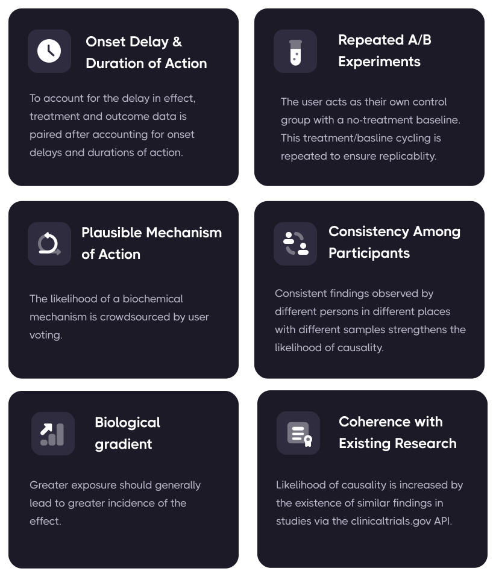
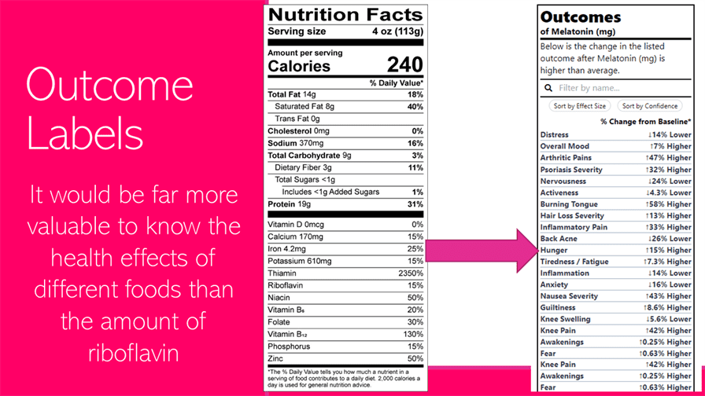

> This is a work in progress. Contributions are welcome! It's our goal to avoid any duplication of effort. So please include existing projects that would be interested in fulfilling any part of this global framework.

# Mission
Maximize average healthy human lifespan and minimize net suffering by quantifying the effects of every food, additive, supplement, and medical intervention.

# Overview

The Wikipedia model demonstrates the tremendous power of crowdsourcing and open collaboration. Despite Microsoft spending billions of dollars hiring thousands of expert PhDs to create Encarta, Wikipedia garnered over 50 times more content in just a few years—all from volunteers. Moreover, studies have shown Wikipedia's accuracy on scientific topics rivals leading encyclopedias. 

The Decentralized FDA aims to produce a 50X acceleration in clinical discovery by replicating this model for clinical research. By crowdsourcing real-world data and observations from patients, clinicians, and researchers, the Decentralized FDA could enable orders of magnitude more insights and discovery than the current closed research system. 

Rather than a few expensive clinical trials conducted by pharmaceutical companies, the Decentralized FDA would facilitate a massive decentralized clinical trial encompassing millions of patients. This "Wikipedization" of evidence-based research can unlock lifesaving knowledge at a fraction of the cost and time of traditional methods. Just as Wikipedia democratized access to knowledge, the Decentralized FDA can democratize health research and empower people with actionable data to improve lives.

# Architecture

This is a very high-level overview of the architecture.  It's a work in progress.  Please contribute!

We've implemented an initial monolithic prototype of this architecture in [apps/centralized-dfda](../apps/centralized-dfda). It would better be described as a Centralized Decentralized FDA.  Our goal is to create a decentralized, simplified, more modular, version of this broken into the components below.  

We don't want to reinvent the wheel in any way, so if there's an existing project that can fulfill the requirements of the components, please let us know or contribute!

## 1. Data Silo API Gateway Nodes

dFDA Gateway API Nodes make it easy for data silos, such as hospitals and digital health apps, to let people export and save their data locally in their [PersonalFDA Nodes](#2-personalfda-nodes). 

### Requirements
   - **OAuth2 Protected API:** Provides a secure, OAuth2-protected API for people to easily access their data.
   - **Personal Access Token Management** - Individuals should be able to create labeled access tokens that they can use to access their data.  They should be able to label their access tokens and monitor the usage of each token.  They should also be able to revoke access tokens at any time and set an expiration date.
   - **Developer Portal:** Developer portal for data silos to easily register and manage their 3rd party application, so they can allow users to share data with their application.
   - **OpenAPI Documentation:** Provide OpenAPI documentation for the API, making it easy for data silos to integrate.
   - **Software Development Kits (SDKs):** Provide SDKs for popular programming languages to make it easy for developers to integrate the API into their applications.
   - **Data Encryption:** Implement robust encryption protocols to safeguard sensitive health data.
   - **HIPAA and GDPR Compliance:** Ensure compliance with HIPAA and GDPR privacy regulations.
   - **Multiple Data Format Options:** Provide multiple data format options for data export, including CSV, JSON, and XML.
   - **Data Structure Options:** Client applications should be able to request should be able to request data in various formats such as FHIR, HL7, and the Common Data Model (CDM).

**Potential Implementations, Components or Inspiration**

There's a monolithic implementation of this in [apps/centralized-dfda](../apps/centralized-dfda).  However, we want to a simplified more configurable version into existing data silos. Feel free to add links to any other open-source projects that could better fulfill this role.

## 2. PersonalFDA Nodes

PersonalFDA Nodes are applications that can run on your phone or computer. They import, store, and analyze your data to identify how various factors affect your health.  They can also be used to share anonymous analytical results with the broader dFDA in a secure and privacy-preserving manner.  

PersonalFDA Nodes are composed of two components, a Digital Twin Safe and an AI agent called Optimitron (or some better name) that uses causal inference to estimate how various factors affect your health.

### 2.1. Digital Twin Safe

A tool for self-sovereign storage of personal data that enables effortless data sharing with clinical safety and efficacy studies.

#### Requirements
   - **Data Import** from all your apps and wearables, so you can centrally own, control, and share all your digital exhaust.
   - **Quantum-Resistant Data Encryption** to safeguard sensitive health data.
   - **Sync to Between Trusted Devices** like your phone or computer or a family member's device to avoid data loss in the case of device failure.
   - **Multifactorial and Biometric Security** because, let's face it, your password is going to get hacked or lost. 

#### Possible Technologies and Frameworks
- **[Obsidian](https://obsidian.md/)** is a personal knowledge base based on the [Electron](https://www.electronjs.org/) framework. It could be a good foundation for a Digital Twin Safe because it has a:
  - open-source license
  - plugin architecture that could be used to implement a variety of features in a modular way
  - built-in peer to peer sync feature
  - robust encryption system
  - and can be built for desktop and mobile
- **[Electron](https://www.electronjs.org/)** is a lower-level framework for creating native applications with web technologies like JavaScript, HTML, and CSS. The main benefit of Electron for the Digital Twin Safe is that it allows you to create cross-platform desktop applications using web technologies. 
- **[Expo](https://expo.io/)** is a set of tools and services built around React Native and native platforms that help you develop, build, deploy, and quickly iterate on iOS, Android, and web apps from the same JavaScript/TypeScript codebase.
   
#### Potential Implementations, Components or Inspiration
- [Modified Gnosis Safe](/digital-twin-safe)
- [Weavechain](https://weavechain.com/)
- [Crowdsourcing Cures App](https://app.crowdsourcingcures.org/app/public/#/app/intro)

### 2.2. Optimitron AI Agent

Optimitron is an AI agent that lives in your PersonalFDA node that uses causal inference to estimate how various factors affect your health. 

Optimitron is an AI assistant that asks you about your symptoms and potential factors. Then she applies pharmacokinetic predictive analysis to inform you of the most important things you can do to minimize symptom severity.

[Or Try the Prototype Here](https://demo.curedao.org/app/public/#/app/chat)

#### Data Analysis

Currently, we've implemented causal inference analysis of sparse time series data that takes into account onset delays and other factors.  

We're working on implementing a more robust pharmacokinetic predictive model control recurrent neural network.

Ideally, Optimitron AI agent will be able to further improve the precision and accuracy of the real-time recommendations over time by leveraging reinforcement learning and community contributions.

## 3. Clinipedia—The Wikipedia of Clinical Research

The Clinipedia wiki contains the aggregate of all available data on the effects of every food, drug, supplement, and medical intervention on human health.  It requires the following features:

   - **Knowledge Base:** Inspiration could be taken from the Psychonaut Wiki. It's a modified version of MediaWiki with additional quantitative metadata storage regarding the pharmacokinetics of various substances.  This could be expanded to document the quantitative effects of every factor on specific health outcomes.
   - **Editing Authorization:** A robust authorization mechanism to maintain content integrity and trustworthiness.
   - **AI-Powered Data Population:** Leverage AI to efficiently populate the wiki with initial research and data.
   - **Data Silos Directory:** Compile a comprehensive directory of existing data sources, facilitating integration with the Digital Twin Safe.
   - **Reputation Scoring:** Develop a transparent and reliable reputation-weighted voting system for intervention approval.
   - **Comparative Policy Analysis** - Aggregate existing approval and certification data from existing national regulatory bodies
   - **Food and Drug Outcome Labels** - Ultimately, the most useful output of a decentralized FDA would be **Outcome Labels** list the degree to which the product is likely to improve or worsen specific health outcomes or symptoms. These are derived from real-world data (RWD) and subject to Futarchical-weighted review by the board members of the dFDA.
   - **Publish Meta-Analyses** - Generate meta-analyses from all completed studies at ClinicalTrials.gov
   - **Certification of Intervention Manufacturers/Sources** via a Decentralized Web of Trust derived from end-user data and reviews traced back using an NFT-tracked supply chain
   - **Intervention Ranking** - Elevate the most promising yet little/known or researched treatments
   - **Decentralized Clinical Trial Coordination and Protocols** - Not only would this increase knowledge but also access and availability of new and innovated treatments to those who need them urgently.
   
**Potential Implementations, Components or Inspiration**
- [Psychonaut Wiki](https://psychonautwiki.org/wiki/Psychoactive_substance_index)
- [Journal of Citizen Science](https://studies.crowdsourcingcures.org/)

# Coordination Platform

The primary initial deliverable a coordination platform. This platform would act as the nexus for facilitating cooperation, communication, and collaborative actions among various stakeholders. It's designed to harness the collective capabilities of existing entities towards achieving the shared vision of accelerated clinical discovery and better health outcomes.

The coordination platform should ideally provide:

1. **Communication Channels**: Enable seamless communication among stakeholders, fostering a community of shared knowledge and goals.
  
2. **Resource Sharing Mechanisms**: Facilitate the sharing of data, technologies, expertise, and other resources among partners.
  
3. **Decentralized Collaborative Workspaces**: Provide tools and spaces for collaborative research, data analysis, and project development.
  
4. **Partnership Agreements**: Streamline the formation and management of partnerships, ensuring clarity on roles, responsibilities, and contributions.
  
5. **Project Management Tools**: Offer tools for planning, tracking, and managing collaborative projects, ensuring alignment and progress towards shared goals.
  
6. **Knowledge Repository**: Create a centralized or federated repository for collective knowledge, research findings, and best practices.
  
7. **Legal and Regulatory Guidance**: Provide guidance on navigating the legal and regulatory landscape for collaborative endeavors, ensuring compliance and mitigating risks.
  
8. **Impact Tracking**: Implement tools for monitoring, evaluation, and reporting on the impact and outcomes of collaborative projects.

9. **Reputation Scoring**: Implement a reputation system to incentivize contributions and reward quality.

The coordination platform encapsulates a digital environment where stakeholders can come together to synergistically work towards the broader objectives of the dFDA initiative. Through this platform, the barriers to collaboration are minimized, and the pace of innovation and discovery is expected to accelerate, aligning with the overarching mission of maximizing human lifespan and minimizing net suffering.

# Roadmap and Milestones

## 1: Establish Foundation
**Objective:** Lay down the groundwork for the Decentralized FDA, defining its scope, audience, and core values.

**Tasks:**
1. **Define Project Scope and Goals:** Clearly outline what the Decentralized FDA aims to achieve, its target audience, and its core mission.
2. **Framing and Naming:** Develop a strong framing narrative and decide on a compelling name for the initiative.
3. **Identify Target Audience:** List potential board members, disease advocacy organizations, and other key stakeholders.
4. **Initial Stakeholder Engagement:** Begin outreach to potential board members and key stakeholders to introduce them to the project and gauge interest.

## 2: Building the Board of Directors
**Objective:** Assemble a diverse and influential Board of Directors to guide and support the initiative.

**Tasks:**
1. **Credibility and Reach:** Identify and onboard individuals with credibility, reach, and a passion for the project’s mission.
2. **Funding Strategies:** Develop strategies for funding, exploring options like health-focused prizes, grants, and private investments.
3. **Define Value Proposition for Board Members:** Clearly articulate what’s in it for them, outlining the impact and benefits of their involvement.

## 3: Collaborations and Partnerships
**Objective:** Identify and engage with entities already working in similar domains to foster collaboration and knowledge sharing.

**Tasks:**
1. **Research Potential Collaborators:** Identify entities, initiatives, and experts working on similar projects.
2. **Initiate Outreach:** Reach out to potential collaborators to explore partnership opportunities.
3. **Develop Collaborative Projects:** Work on joint initiatives, sharing knowledge and resources for mutual benefit.

## 4: Develop the Data Silo Gateway API Nodes
## 5: Develop the PersonalFDA Nodes
## 6: Creating the Clinipedia dFDA Wiki

