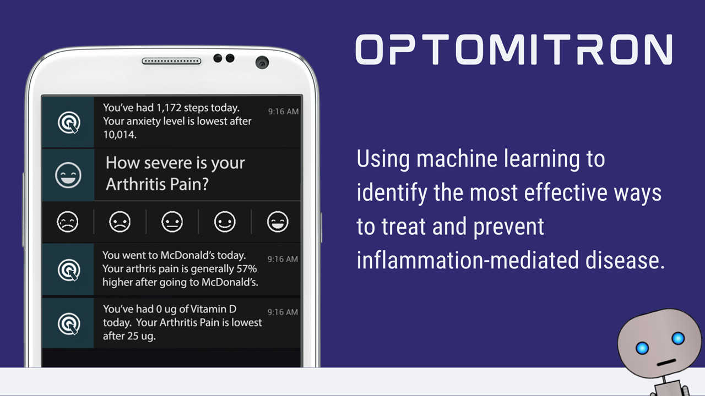

# A Control Systems Engineering Approach to Precision Medicine

☝️The image above is what we're trying to achieve here.

To determine the effects of various factors on health outcomes, we currently apply pharmacokinetic modeling over various onset delay and duration of action hyper-parameters and combine that with some other parameters for each of Hill's criteria for causality.  

The distributions in this type of data aren't super normal, and you've got the onset delays and durations of action so regular Pearson correlations don't work so well. So we mainly focus on change from baseline. There's a ton of room for improvement by controlling using instrumental variables or convolutional recursive neural networks.

Hybrid Predictive Control Black Box Models seem most appropriate.

## Test and Training Data

See the [data folder](data).  

The best file is probably [data/arthritis-factor-measurements-matrix-zeros-unixtime.
csv](data/arthritis-factor-measurements-matrix-zeros-unixtime.csv). It's a matrix of years of self-reported 
Arthritis Severity Rating measurements and hundreds of potential factors over 
time.  

### Format

The first row is the variable names. The first column is Unix timestamp (seconds since 1970-01-01 00:00:00 UTC). 

### Pre-Processing

To make it easier to analyze some preprocessing has been done. This includes zero-filling where appropriate.  Also, 
the factor measurement values are aggregated values preceding the Arthritis measurements based on the _onset 
delay_ and _duration of action_.  

### Hyper-Parameters

The aggregation method and other hyper-parameters can be found by putting the **Variable Name** in either
1. the [API Explorer](https://curedao.readme.io/reference/getvariables) or
2. in the URL `https://studies.dfda.earth/VARIABLE_NAME_HERE`.

## Resources

- [Relevant Research, Libraries and Code Examples](https://anonymous-dao.notion.site/abae832157094601a85d0cb76114059d?v=ea85efb370164df68760ab99b0108cb6)
- [Example Current Study](https://app.curedao.org/#/app/study?causeVariableName=Calories%20Burned&effectVariableName=Guiltiness&studyId=cause-1280-effect-1335-user-230-user-study)
- [TODO: Observable notebook](https://observablehq.com/@observablehq/correlation-over-time?collection=@observablehq/analyzing-time-series-data)
- https://github.com/wishonia/FDAi/tree/develop/docs/components/data-analysis
